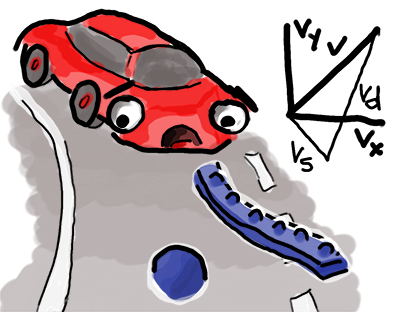
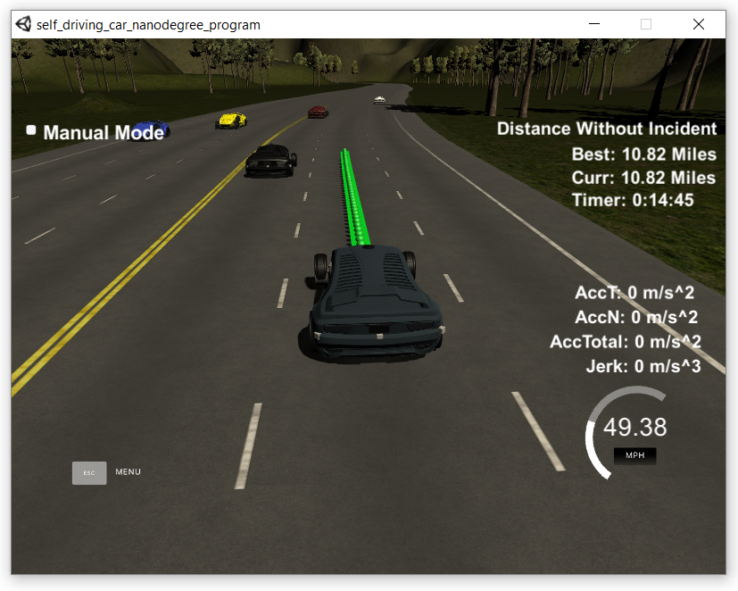

# Self Driving Car Engineer Project 11 - Path Planning
## Benjamin Söllner, 25 Nov 2017

---



---



In this C++ project the goal is to safely navigate around a virtual highway with
other traffic that is driving +/- 10 mph of the 50 mph speed limit. The simulator
that drives the car is providing the path planner the car's localization and
sensor fusion data; there is also a sparse map list of waypoints around the
highway.

The car should try to go as close as possible to the 50 mph speed limit, which
means passing slower traffic when possible, however, other cars will try to
change lanes too. The car should avoid hitting other cars at all cost as well
as driving inside of the marked road lanes at all times, unless going from one
lane to another. The car should be able to make one complete loop around the
6946m highway. Since the car is trying to go 50 mph, it should take a little
over 5 minutes to complete 1 loop. Also the car should not experience total
acceleration over 10 m/s^2 and jerk that is greater than 50 m/s^3.

[](https://youtu.be/gIHYBOWJqXw)

## Reflection

In the following subsections, I will first describe the path generation method
in more detail and then address how I managed to pass each rubric point in order
to avoid any "incidents", as classified by the simulator, over the 4.32 mile
long track.

### General Path Generation Model Documentation

The path generation model follows the [project walkthrough](https://classroom.udacity.com/nanodegrees/nd013/parts/6047fe34-d93c-4f50-8336-b70ef10cb4b2/modules/27800789-bc8e-4adc-afe0-ec781e82ceae/lessons/23add5c6-7004-47ad-b169-49a5d7b1c1cb/concepts/3bdfeb8c-8dd6-49a7-9d08-beff6703792d)
by Udacity. The following steps are applied (all line references in relationship
to ``main.cpp``):

1. ll. 248-360: All cars from the sensor fusion data are examined and we are
performing a high-level decision whether changing lanes (``my_ref_lane``) or
changing speed (``my_ref_speed``). Influencing the cars decision are:
  * Is there any car in front of us so we have to change lanes or slow down.
  (``bool change_lanes_or_slow_down``)
  * Are there cars obstructing the right or left lanes so we cannot change
  lanes and *must* slow down? This also includes cars that are switching lanes
  and thusly have a horizontal velocity component in Frenet space.
  (``bool dont_go_left`` and ``bool dont_go_right``)
  * Also, we do not change lanes if we are already in a right-most or left-most
  lane; we also don't perform a double-lane-change (checking ``changing_lanes``)   or a lange change below 20mph.
  * Is the distance to the closest car in front of us in the target lane
  greater than the distance to the car in front of us in our lane (by
  examining ``double min_dist_left``, ``double min_dist_right`` and
  ``double min_dist_here``).

2. ll. 362-424: A spline is constructed to sample new trajectory points from
  * Its first control points are the last two points of the non-processed/remaining
  path that is returned by the simulator.
  * If currently no points were returned by the simulator, it starts with the
  current vehicle position.
  * To that, 3 more control points with distance 30, 60 and 90m ahead of the
  last point in Frenet space are added. (ll. 400-406)
  * The spline control points are transformed to vehicle coordinates with x
  pointing ahead, so that the spline is a well-defined function with unique
  x-to-y resolution for all x. (ll. 413-420)

3. ll. 426-463: The spline is sampled to return the trajectory points that the
path should follow.
  * The spline is first filled with the points that were returned from the
  simulator and were not processed yet (ll. 430-434)
  * The spline is always sampled up to 30m ahead (``target_x_car``, ll. 439).
  * The number of points that are sampled (and the distance between the sampled
  points) is determined by the reference velocity, so that the car covers the
  correct distance between each trajectory point of which one is passed every 0.2s.   

In the following subsections I go into detail about the nuances in the code
that make me pass each aspect of the rubric requirement of "no incident occuring".

### Driving According to Speed Limit

* The speed limit is checked first in (1.) (see above) by only increasing the
reference velocity if the speed limit is not reached (see ll. 357 ff.):
```c++
} else if (my_ref_vel < 49.5) {
   // if we are too slow, speed up (obeying max. accell. & velocity)
   my_ref_vel += .224;
}
```
* In order to obey the reference velocity, the distance and number of data
points sampled along the spline in (3.) (see above) is dependent on the
reference velocity (see ll. 444f.):
```c++
// calculate spacing of points needed to find reference velocity
double num_points = target_dist / (.02*my_ref_vel/2.24);
```

### Obeying Maximum Acceleration and Jerk

* Maximum acceleration and jerk are obeyed by only increasing and decreasing
the velocity in small increments in (1.) (see above) (see ll. 349 + 359):
```c++
my_ref_vel -= .224;
[...]
my_ref_vel += .224;
```
* Even then, some exceeding jerk and acceleration can happen if a lane change
across multiple lanes occured. In order to register whether we are changing
lanes, in (1.) (see above), we compare the current lane, derived from the car's
d-value (0..4m for lane 0, 4..8m for lane 1 etc., see ll. 263) ...
```c++
short my_lane = ((short)floor(my_d/4));
```
... with the car's reference lane (``my_ref_lane``), that is kept as a state
between request-reply cycles. We then set ``changing_lane`` (ll. 264) ...
```c++
bool changing_lanes = (my_lane != my_ref_lane);
```
... and use it as a flag to prevent double-lane-changes

### Avoiding Collisions

This was by far the most challenging requirement and is currently probably
implemented rather conservatively, leading to some slow-downs where speeding up
and snugly fitting into a gap could probably improve performance. It was mostly
handled by the policy implented in (1.) (see above).

We ``change_lanes_or_slow_down`` (``== true``) if any car is currently ahead
of us. But in order to make the final decision which of the two options it is,
we also account for the following high-level observations:

* We check if the right lane or left lane is free of traffic (``dont_go_right``,
``dont_go_left``)
* We also do not double-change lanes  (``changing_lane``, see also previous
section)
* We do not change lanes if our speed is below 20mph.

See also ll. 343ff.:
```c++
// if car too close is in front of car
if (change_lanes_or_slow_down) {
  // if we are already changing lanes or cannot change
  if (changing_lanes || (dont_go_left && dont_go_right) || my_ref_vel < 20) {
    // slow down instead (obeying max. accell. & velocity)
    // [...]
  }
  // [...]
}
```

To derive the variables ``change_lanes_or_slow_down``, ``dont_go_left`` and
``dont_go_right``, from the low-level sensor fusion data of each car on the
road, more and more high-level features are generated:

First, position in *x*/*y* + *d*/*s* and velocity are extracted from the inputs
(``o_x``, ``o_y``, ``o_y``, ``o_d``, ``o_vx``, ``o_vy``, ``o_s``). Based on that
**longtudinal** and **lateral** features are derived

**Longitudinal**: First we infer if the car is closer than 30m ahead (``o_is_ahed``),
closer than 15m behind (``o_is_behind``) or just in an "inner circle" of
10m ahead or behind (``o_is_close``).

**Lateral**: This follows a 3-layered approach:
* Additional velocity metrics (*vs*, *vd*, *v*) are calculated by trigonometry
(``o_vd``, ``o_vs``, ``o_v``), out of this "falls" also a feature that tells
us, if the car is slower than us (``o_is_slower``).
* The car's lane (``o_lane``) is calculated from its *d* value and a potential
merge / lane-change of a car to another lane (``o_merging_lane``) is inferred
by a significant *vd* value.
* Based on ``o_lane`` and ``o_merging_lane``, the high-level flags that
specify if a car is on my lane or the lanes next to me are set
(``o_is_in_my_lane``, ``o_is_left``, ``o_is_right``).

**Combining both**: Both are then combined to determine if a car is an obstacle
for a lane change (ll. 324ff.):
```c++
bool o_is_obstacle = ( (o_is_ahead && o_is_slower)
                                      || (o_is_behind && !o_is_slower)
                                      || o_is_close
                              );
// don't switch lanes if the car is dangerous
dont_go_left  = dont_go_left || (o_is_left && o_is_obstacle);
dont_go_right = dont_go_right || (o_is_right && o_is_obstacle);
```

As indicated initially, I admit that this approach is far from perfect.
Especially the heuristic, that tries to guess whether a car is changing lanes
(``o_merging_lane``) sometimes fails. It seems that ``o_vd``, which is
calculated relying on the normal vector of the closest waypoint, is inaccurate,
leading sometimes (especially in curves) to predictions of "phantom lane changes"
of other cars. A resolution would probably be to find a more accurate normal
vector by sampling between two waypoints or by finding a better heuristic,
potentially involving tracking of cars over various simulator cycles.

### Staying Inside Reference Lane

Staying inside the reference lane is achieved by keeping *d* constant in the
interpolation of the target trajectory in (3.) (see above) (ll. 402f.):

```c++
  vector<double> controlpoint = getXY(my_s+spacing, (2+4*my_ref_lane),
          map_waypoints_s, map_waypoints_x, map_waypoints_y);
```

The *d* value is set to the value ``2+4*my_ref_lane``, whereas ``my_ref_lane``
is kept constant as a state variable between simulator runs.

### Smoothly Changing Reference Lanes

Changing lanes smoothly is achieved by modifying ``my_ref_lane``. Since always
some portion of the previous path is kept, the spline interpolation (see previous
subsection) between the old trajectory segment and the new segment, now with
updated ``my_ref_lane``, results in a smooth trajectory. Lane changes (i.e.,
increments / decrements of ``my_ref_lane`` are only performed after
preliminary safety checks (see "Avoiding Collisions").

In addition to the safety checks, lane changes are only performed when they
make sense. This includes checking via three minimum-variables which car is
the closest car ahead in the current lane as well as in the lane to the left
and to the right (see ll. 265, ll. 311ff. and esp. ll. 338ff.):

```c++
// don't switch lanes if leading car in target lane is closer than
// leading car in current lane
dont_go_left  = dont_go_left  || (min_dist_left < min_dist_here);
dont_go_right = dont_go_right || (min_dist_right < min_dist_here);
```

## Environment

### Interfaces

#### Data in ``data/highway_map.txt``

Each waypoint in the list contains  [*x*,*y*,*s*,*dx*,*dy*] values. x and y are
the waypoint's map coordinate position, the s value is the distance along the
road to get to that waypoint in meters, the dx and dy values define the unit
normal vector pointing outward of the highway loop.
The highway's waypoints loop around so the frenet s value, distance along the
road, goes from 0 to 6945.554.

#### WebSocket Interfaces between Simulator and Path Planner

* Main car's localization data (no noise):
  * ``["x"]``: The car's x position in map coordinates
  * ``["y"]``: The car's y position in map coordinates
  * ``["s"]``: The car's s position in frenet coordinates
  * ``["d"]``: The car's d position in frenet coordinates
  * ``["yaw"]``: The car's yaw angle in the map
  * ``["speed"]``: The car's speed in mph
* Previous path data given via WebSockets from Simulator
  * **Note**: Return the previous list but with processed points removed, used
  to show how far along the path has processed since last time.
  * ``["previous_path_x"]``: The previous list of x points previously given to
  the simulator
  * ``["previous_path_y"]``: The previous list of y points previously given to
  the simulator
* Previous path's end s and d values
  * ``["end_path_s"]``: The previous list's last point's frenet s value
  * ``["end_path_d"]``: The previous list's last point's frenet d value
* Sensor Fusion Data, a list of all other car's attributes on the same side
of the road (no noise):
  * ``["sensor_fusion"]``: A 2d vector of cars and then that car's
  [car's unique ID, car's x position in map coordinates, car's y position in map
  coordinates, car's x velocity in m/s, car's y velocity in m/s, car's s
  position in frenet coordinates, car's d position in frenet coordinates].

### Assumptions

1. The car uses a perfect controller and will visit every (x,y) point it
recieves in the list every .02 seconds. The units for the (x,y) points are in
meters and the spacing of the points determines the speed of the car. The vector
going from a point to the next point in the list dictates the angle of the car.
Acceleration both in the tangential and normal directions is measured along with
the jerk, the rate of change of total Acceleration. The (x,y) point paths that
the planner recieves should not have a total acceleration that goes over
10 m/s^2, also the jerk should not go over 50 m/s^3. (NOTE: As this is BETA,
these requirements might change. Also currently jerk is over a .02 second
interval, it would probably be better to average total acceleration over 1
second and measure jerk from that.

2. There will be some latency between the simulator running and the path planner
returning a path, with optimized code usually its not very long maybe just 1-3
time steps. During this delay the simulator will continue using points that it
was last given, because of this its a good idea to store the last points you
have used so you can have a smooth transition. ``previous_path_x``, and
``previous_path_y`` can be helpful for this transition since they show the
last points given to the simulator controller with the processed points
already removed. I returned a path that extends this previous
path.

### Dependencies

* cmake >= 3.5
 * All OSes: [click here for installation instructions](https://cmake.org/install/)
* make >= 4.1
  * Linux: make is installed by default on most Linux distros
  * Mac: [install Xcode command line tools to get make](https://developer.apple.com/xcode/features/)
  * Windows: [Click here for installation instructions](http://gnuwin32.sourceforge.net/packages/make.htm)
* gcc/g++ >= 5.4
  * Linux: gcc / g++ is installed by default on most Linux distros
  * Mac: same deal as make - [install Xcode command line tools]((https://developer.apple.com/xcode/features/)
  * Windows: recommend using [MinGW](http://www.mingw.org/)
* [uWebSockets](https://github.com/uWebSockets/uWebSockets)
  * Run either `install-mac.sh` or `install-ubuntu.sh`.
  * If you install from source, checkout to commit `e94b6e1`, i.e.
    ```
    git clone https://github.com/uWebSockets/uWebSockets
    cd uWebSockets
    git checkout e94b6e1
    ```
* Simulator: You can download the Term3 Simulator which contains the Path
Planning Project from the [releases tab](https://github.com/udacity/self-driving-car-sim/releases).


### Includes

* A really helpful resource for doing this project and creating smooth
trajectories was using http://kluge.in-chemnitz.de/opensource/spline/, the
spline function is in a single hearder file is really easy to use.

### Development Environment

I used a combination of Windows 10 Home + Docker (with Boot2Docker in Virtual Box) running GNU Build tools + Netbeans with Remote Debugging.

If this is the setup you want to use, there are some ressources to get started in the ``ide_profiles/netbeans-win10-docker`` folder. The docker container set up there even allows for X11 forwarding of graphics produced by matplotlib!

### Building

1. Clone this repo.
2. Make a build directory: `mkdir build && cd build`
3. Compile: `cmake .. && make`
4. Run it: `./path_planning`.

## Submitted Files

* [``README.md``](README.md), [``readme.html``](readme.html): you are reading it! :)
* [``src/main.cpp``](src/main.cpp): Boilerplate code, code for websocket communication as
well as path planner logic
* ``ide_profiles/netbeans-win10-docker``: some ressources to get started with a development environment based on Windows 10 Home + Docker (with Boot2Docker in Virtual Box) running GNU Build tools + Netbeans with Remote Debugging. Even includes X11 forwarding of graphics produced by matplotlib to Xming on Windows or similar.
